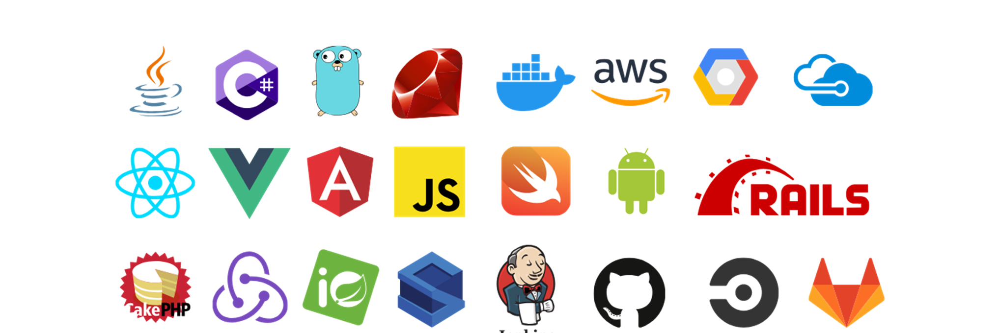
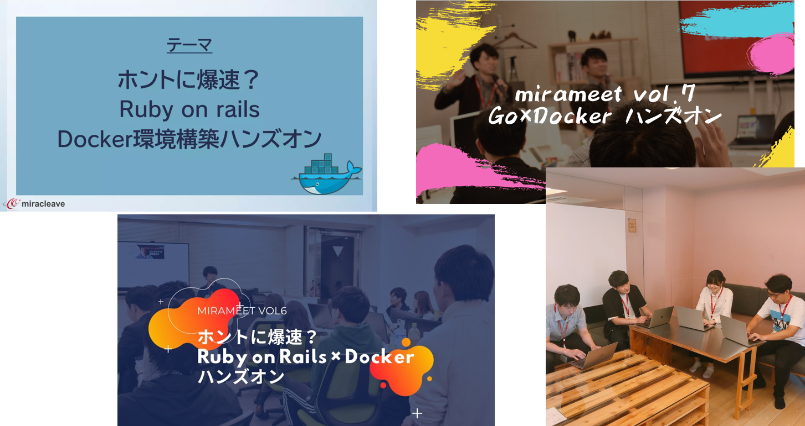
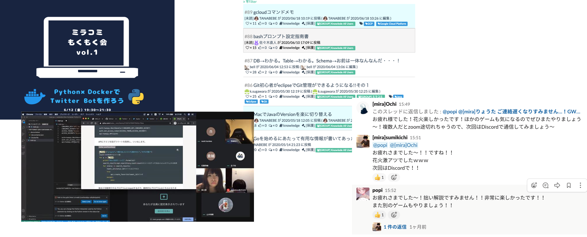
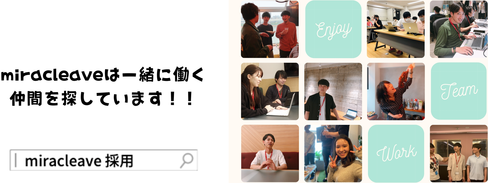

# 会社紹介

miracleaveでは、「テクノロジーで未来を切り拓く」をミッションに掲げ、
国内だけでなく、今後は海外向けのサービス展開に取り組み、日本を含む世界中の人々に感謝されるようなサービスを提供していきます。

「新しいことに挑戦したい」「自分の技術を磨きたい」など、あなたが持つポジティブなモチベーションを、miracleaveという舞台の「主役」として最大限に発揮しませんか？

## 技術スタック

この他にもプロジェクトによって、様々なものを活用しています！

## mirameetとは

月に1度、社外にも開放した勉強会を様々なテーマで開催しています。一人で勉強して満足するのではなく、“人に伝える”ということも大事にしており、社内外問わず発信しています。

他社さんとタイアップしたり、とにかく楽しく！まずやってみるをモットーにフラットに意見を言い合ってより価値の高いものを作ろうとしています。

## ミラコミとは

**弊社が独自に運営しているコミュニティです！**

コミュニティでは、開発ナレッジ見ることができたり、もくもく会を開催したり、弊社メンバーに限らずベンチャー社員、フリーランスの方が参加しており、技術を高めながら、エンジニア同士の横のつながりも作ることができます。

他にもBBQやダーツ大会、ボードゲーム、スマブラ大会などとにかく楽しくをモットーにスキルアップだけではなく様々なイベントにも参加いただけます。

## 次回のmirameetについて

### 応募はこちらから

