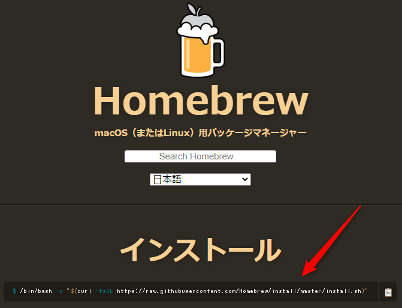

# Homebrewインストール手順

## Homebrewとは


OSや言語毎にパケージマネージャとよばれるツールが提供され、ソフトウエアや拡張機能のインストールはパッケージマネージャを利用して行うことができます。

HomebrewはMac用のパッケージマネージャーとなります。

## インストール手順

1. ターミナルを起動する。
2. [インストールページ](https://brew.sh/index_ja)にアクセスし、インストールコマンドを確認します。

3. ターミナルにインストールコマンドを入力し、実行します。

```bash
/bin/bash -c "$(curl -fsSL https://raw.githubusercontent.com/Homebrew/install/master/install.sh)"
```

### 動作確認

- brewコマンドが実行できればインストール完了です。

```bash
brew -v
Homebrew 2.2.11
Homebrew/homebrew-core (git revision 23625a; last commit 2020-03-25)
```

以上でインストールは完了です。
