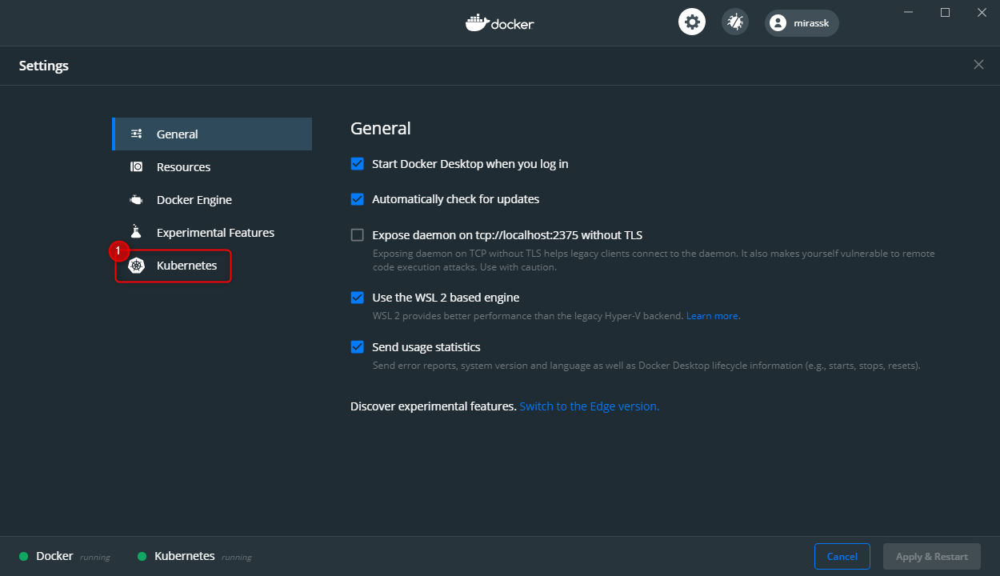
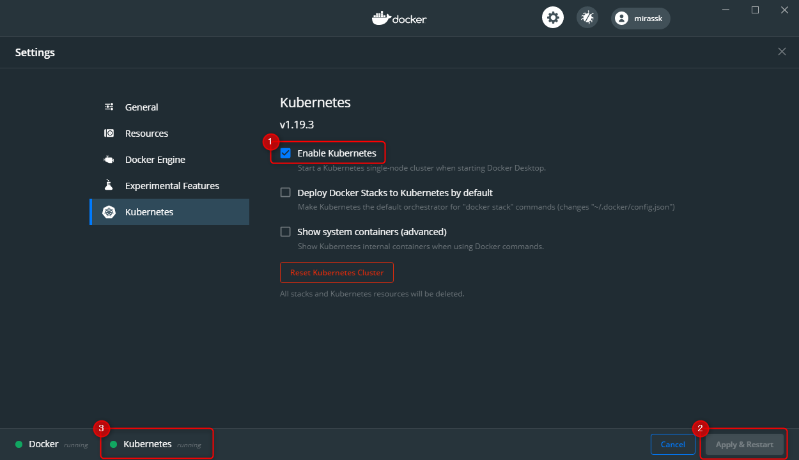

# はじめに

## 前提

- [Docker Desktop](https://www.docker.com/products/docker-desktop)
- [Git](https://git-scm.com/)

※Windows/MacOSで確認しました。

## Kubernetes

Docker Desktopには、Kubernetesサーバーとクライアントが内包されています。
Dockerインスタンス内でローカルに実行され、単一ノードクラスターとなっています。

1. タスクバーにあるを右クリックして、 `Settings` を選択してください。
2. メニューにある `Kubernetes` を選択してください。
    
3. `Enable Kubernetes` をチェックし、 `Apply&Restart` をクリックしてください。  
    しばらくすると③の箇所にKubernetes Runningと表示します。
    

## Kompose

### Windowsの場合

Windowsでは、Chocolateyでインストールできます。

※Chocolateryをインストールしていない方は[こちら](Chocolatery.md)

```PowerShell
choco install kubernetes-kompose
```

### MacOSの場合

MacOSでは、Homebrewでインストールできます。

※Homebrewをインストールしていない方は[こちら](Homebrew.md)

```Shell
brew install kompose
```
