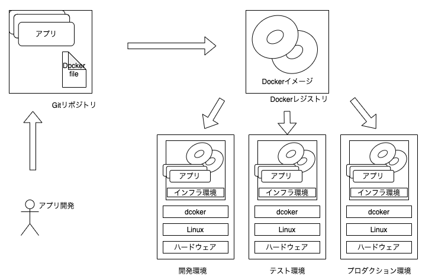

# Section1

### 目次
No.1 Dockerとは 
No.2 Kubernetesとは 
No.3 Kubernetesのそれぞれのサービスの概要 
No.4 Komposeとは 

  

## Dockerとは
### 概要
コンテナ技術を使ったアプリケーションの実行環境を構築/運用するためのプラットフォームです。アプリケーションの実行に必要な物を一つにまとめ、Dockerイメージ管理することで、アプリケーションの可搬性を上げることができます。
 

### コンテナとは
現実世界で表すと以下のような物です。 

（コンテナの写真）

コンテナは内部に物を貯める容器で運搬可能です。 
陸から船に運ぶ際にクレーンなどを使ってコンテナを移動させます。 
このように現実世界でのコンテナは非常に便利で物を貯めて持ち運ぶのを容易にしてくれます。  

では、コンピュータの世界のコンテナとは一体どんなものなのか？  

コンテナはアプリケーションの実行に必要なモジュール（ファイルやディレクトリ群）をコンテナとしてまとめることができ、複数のコンテナを組み合わせることで１つのアプリケーションを構築することができます。
しかもこのコンテナの元となるDockerイメージをDocker Hub（リポジトリ）などのリポジトリで共有することによって、Dockerをインストールしている環境であれば誰でも一緒の環境を構築することができます。  

### Dockerのメリット 
#### ・資源の効率化 
Dockerはホストカーネルを共有し、従来のハイパーバイザ型のHyper-Vやホスト型のVirtualBox等のようにOSを丸ごとインストールする必要がなく資源を効率的に扱える。 

#### ・アプリ実行環境構築の容易さ 
Dockerはアプリケーションとライブラリを同一のコンテナ内に固めることができ、一度固めたコンテナは軽量で持ち運びが容易。DockerがインストールされているOSであれば移動が容易に行える。 

#### ・設定間違いなどの不可逆的操作の廃棄の容易さ 
複雑なシステムであれば一度設定を間違えると、影響範囲の調査などに時間がかる可能性があります。しかしDockerであれば設定を間違えたと思えばすぐさま削除することができる。変更も「Docker file」を修正することで再構築でき、イメージを段階的に残しておくことで設定間違いの前の状態にすぐにもどることができる。   

## Kubernetes(K8s)とは 
Kubernetes（クバネティス/クバネテス/クーべネティス、K8s）は、米Googleのエンジニアを中心とするコミュニティで開発が進められている、オープンソースのコンテナオーケストレーションシステムです。Googleだけでなく、Microsoft,Rds Hat,IBMなどが開発に参加しています。提供機能も豊富で開発スピードも早く、大規模なシステムでの導入実績も豊富でコンテナオーケストレーションツールのデファクトスタンダートとも言えます。 
※コンテナオーケストレーションツールはKubernets以外にも、docker SwarmやApache Mesosなどがあります。 

### なぜKubernetesなどのコンテナオーケストレーションシステムがあるのか 
もしKubernertesなどのコンテナオーケストレーションシステムがなかった場合、複数のDockerの管理、ホストが違うコンテナ間のネットワーク管理、コンテナの監視、サーバーが停止した際の対応などが大変になります。小規模の場合は別途作業すればいいのですが、規模が大きくなるほど煩雑になります。  

例
DBを必要としない単純なwebサイトがあるとします。一台のDockerがインストールされているサーバーにnginxとphpのコンテナを立てます。最初の頃は問題なく動いていましたが、アクセス数が増えたためもう一つ同じ構造のサーバーを立てます。さらにアクセス数が増え１０台のサーバーを立てる必要がありました。それぞれのサーバーにはnginxとphpのコンテナが立っています。
これらnginxとphpのコンテナが立っている１０台のサーバーの面倒を見るとなるとかなり大変です。
そこで使うのが、k8sなどのコンテナオーケストレーションシステムです。このk8sなどを使うことによって一台ずつサーバーを管理する必要がなくなり、サーバーが１つダウンした際には自動で新しいサーバーを立ててくれたり、監視するのも一台ずつではなく１０台のサーバーとすべてのコンテナをまとめて監視することができます。  

このようにk8sがあることによって、規模の大きいDockerの管理や自動化を容易に行えます。   

## Kubernetesのそれぞれのサービスの概要 
### コンポーネント 
コンポーネントとはk8sを構成しているものです。 
大きく分けてコントロールプレーンとノードがあります。

| 名前        |役割                |
|:-----------|:------------|
| Control Planes     |k8sの心臓部分。指揮者的な役割 別名：Admin、Master      |
| Nodes     |実際にコンテナが動作する環境。演奏する側 別名：worker     |

 

 
画像元https://kubernetes.io/ja/docs/concepts/overview/components/
 

### クラスタ(Kubernetes Cluster) 
クラスタとは、アプリケーションを実行するためにKubernetesが使用する物理マシンや仮想マシン、その他のインフラリソースのセットのことを指します。 
つまり、Control PlanesとNodesのかたまりをクラスタと呼びます。 

### コンポーネント（Control Planes） 
#### etcd(バックエンドデータベース)
etcdと呼ばれる分散キーバリューストア(KVS)を使って、クラスタの構成情報を管理しています。
※KVSとは、データ管理システムの種類の一つで、保存したいデータ（value：値）に対し、対応する一意の標識（key：キー）を設定し、これらをペアで格納する方式。 

#### API Server
Kubernetesのリソース情報を管理するためのフロントエンドのREST APIです。他のコンポーネントはetcdの情報にAPI Serverを介してアクセスします。 
また、プログラマがこのAPI Serverにアクセスするには後ほど説明するKubectlコマンドやWebのGUIツールを使います。
Kubernetesの受付役のような存在です。 

#### Scheduler
SchedulerはPodをどのノードで動かすかを制御するバックエンドコンポーネントです。ノードの割り当てられていないPodに対して、k8sクラスタの状態を確かめ、空きスペースを探してPodを実行させるスケジューリングを行います。 

#### Kube Controller Manager
k8sクラスタの状態を常に監視するバックエンドコンポーネントです。定義ファイルで指定したものと実際のノードやコンテナで動作している状態をまとめて管理しています。 

#### Cloud Controller Manager
クラウド（AWS/GCP/Azuruなど）の機能と連携する(ロードバランサー) 

### コンポーネント（Nodes）
| 名前        |役割                |
|:-----------|:------------|
| kubelt     | 各ノードで実行されるエージェント マスターノードとやりとりして指示に従う     |
| kube-proxy     | NodeのNWルール（iptablesなど）を追加、削除、変更している      |
| コンテナランタイム     | コンテナを実行するためのソフトウェア      |

### ノード(Node)
ノードは、Kubernetesを実行している物理マシンまたは仮想マシンで、ポッドを動かします。ノードの管理はマスターサーバが行います。
 

（写真）

### ポッド(Pod)
Pod は1つ以上のコンテナから構成されており、ネットワークは隔離されておらず、IP Addressなどは共有しています。Kubernetesの最小単位です。
 

(写真)

### レプリカセット(Replica Set)
レプリカセットは、指定した数のポッドレプリカがいつでも実行されていることを確認します。両方とも、複製されたシステムの簡単なスケーリングを可能にし、ポッドが再起動したとき、または失敗したときにポッドの再作成を処理します。
クラスタ内にPodをいくつ起動しておくかの値を「レプリカ数」と呼びます。 
また、Podがダウンしてしまった際にも、Replica Setは指定されたレプリカ数になるようにコンテナを起動します。
### Deployments(デプロイメント)
DeploymentsはPodとReplicaSetをまとめたもので、ReplicaSetの履歴を管理をします。
Deploymentオブジェクトの目的の状態を記述するだけで、目的の状態に変更してくれます。 
### Service(サービス)
サービスは、単一の安定したIPアドレスや対応するDNS名など、一連のポッドとそれらにアクセスする手段を定義します。
Serviceにはいくつか種類があり、そのうちのよく使われる３つを紹介します。 
#### ・clusterIP
ClusterIPはKubernetes内での通信で利用します。クラスタ内でIPアドレスが払い出され、それを利用してPod間で通信を行います。
#### ・NodePort
NodePortはKubernetesのNodeのランダムなポートを使用して外部のサーバーからの疎通性を取ってくれます。 その後はClusterIPのServiceと同様です。
#### ・LoadBalancer
LoadBalancerはNodePortのServiceを作成した上で、さらに外部のLoadBalanerを作成し、LoadBalancerのUpstreamとしてNodePortで疎通性を取っているポートへ転送するよう設定してくれます。

### ラベル(Label)
ラベルは、ポッドなどのリソースにアタッチされるキー/値のペアです。ラベルを使用して、リソースのサブセットを整理し、選択することができます。 
### kubectl
API経由でKubenetesを操作するためのクライアントツール   

## Komposeとは
docker-compose.yml をk8s用の設定ファイルに変換してくれるツールです。

