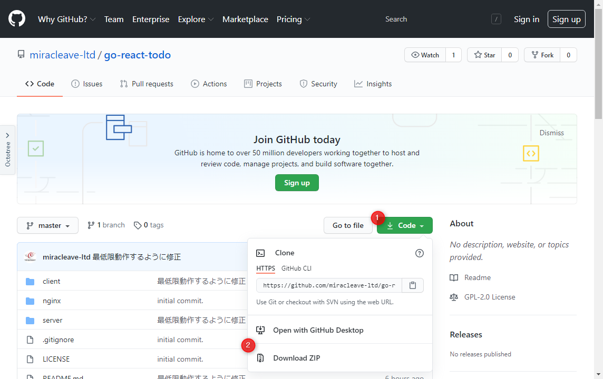

# Section2

## Komposeを利用して、Kubernetes用yamlを作成しよう

1. React+Go(Gin)+PostgresSQLのTodoアプリを使用していきます。  
    今回利用するアプリを[GitHub](https://github.com/miracleave-ltd/go-react-todo)よりプログラムをダウンロードします。

    

2. ローカル環境にDockerイメージを作成します。  
    ※ダウンロードしたファイルを解凍したフォルダで実行してください。

    1. フロントアプリのビルドを行います。  
        次のコマンドを実行してください。

        ```shell
        docker-compose run client npm run build
        ```

        

    2. バックエンドのビルドを行います。  
        次のコマンドを実行してください。

        ```shell
        docker-compose run server go build
        ```

        

    3. アプリイメージのビルドを行います。  
        次のコマンドを実行してください。

        ```shell
        docker-compose -f docker-compose.prod.yml build
        ```

         

3. Komposeでは、docker-compose.ymlファイルにKompose用Labelsを記載することで、Kompose用の設定を行うことができます。  
    
    参考URL：https://kompose.io/user-guide/

    今回は以下の３点を修正します。
    - ローカルでKubernetesを実行するため、 `kompose.service.type` を設定します。
    - ローカルコンテナイメージを利用するため、 `kompose.image-pull-policy` を設定します。  
    - Komposeで `depends_on` が対応していないため、 `port` を追加で設定します。

    対象ファイル：(go-react-todo-master)/docker-compose.prod.yml  
    ※port,labelsを追加しています。

    ```yml
    version: '3'
    services:
        postgres:
            image: postgres
            environment:
                - POSTGRES_PASSWORD=postgres
            ports:
                - "5432:5432"
        server:
            build: ./server
            command: ./app
            ports:
                - "3001"
            depends_on:
                - "postgres"
            environment:
                - POSTGRES_PASSWORD=postgres
            labels:
                kompose.image-pull-policy: Never
        nginx:
            build: ./nginx
            ports:
                - "8000:80"
            labels:
                kompose.service.type: nodeport
                kompose.image-pull-policy: Never
    ```

4. Komposeコマンドでdocker-compose.ymlを変換します。  
    今回は開発時の者は不要ですので、production環境用のymlファイルをもとに変換します。  
    ※ダウンロードしたファイルを解凍したフォルダで実行してください。

    ```Shell
    kompose convert -f docker-compose.prod.yml
    ```

    (WindowsPowerShell)
    

5. 変換後の確認を行います。  
    次のファイルが生成されていることを確認してください。

    - nginx-service.yaml
    - postgres-service.yaml
    - server-service.yaml
    - nginx-deployment.yaml
    - postgres-deployment.yaml
    - server-deployment.yaml

6. Kubernetes用のyamlファイルは生成できたのですが、Komposeの変換だけでは対応しきれない部分の修正を行います。  
    ローカルイメージを取得するため、ローカルイメージ名を記載します。  

    対象ファイル：(go-react-todo)/server-deployment.yaml

    Windowsの場合

    ```yml
    - [36] image: server
    + [36] image: go-react-todo-master_server
    ```

    Macの場合

    ```yml
    - [34] image: server
    + [34] image: go-react-todo-master_server
    ```

    対象ファイル：(go-react-todo)/nginx-deployment.yaml

    Windowsの場合

    ```yml
    - [33] - image: nginx
    + [33] - image: go-react-todo-master_nginx
    ```

    Macの場合
    ```yml
    - [31] - image: nginx
    + [31] - image: go-react-todo-master_nginx
    ```

7. Kubernetesに変換したファイルをKubernetesに反映します。

    ```Shell
    kubectl apply -f nginx-service.yaml -f postgres-service.yaml -f server-service.yaml -f nginx-deployment.yaml -f postgres-deployment.yaml -f server-deployment.yaml
    ```

    (WindowsPowerShell)
    

8. Kubernetesの状態確認を行います。

    ```Shell
    kubectl get pod,deploy,svc
    ```

    ※kubectlでは略語を使用できます。

| 名称        | 略称   |
| ----------- | ------ |
| pods        | pod    |
| deployments | deploy |
| services    | svc    |

    (WindowsPowerShell)
    

9. Kubernetesに反映したプロジェクトを確認します。  
    Kubernetesの状態確認を行った際にNginxの公開されているポートを確認します。  
    NodePortは動的にポート番号を割り振るため、個々の端末によって異なります。  
    

    上記で確認したポート番号のLocalhostにアクセスしてください。  
    http://localhost:XXXXX

    Todoアプリが表示しましたらデプロイ完了です。
    
