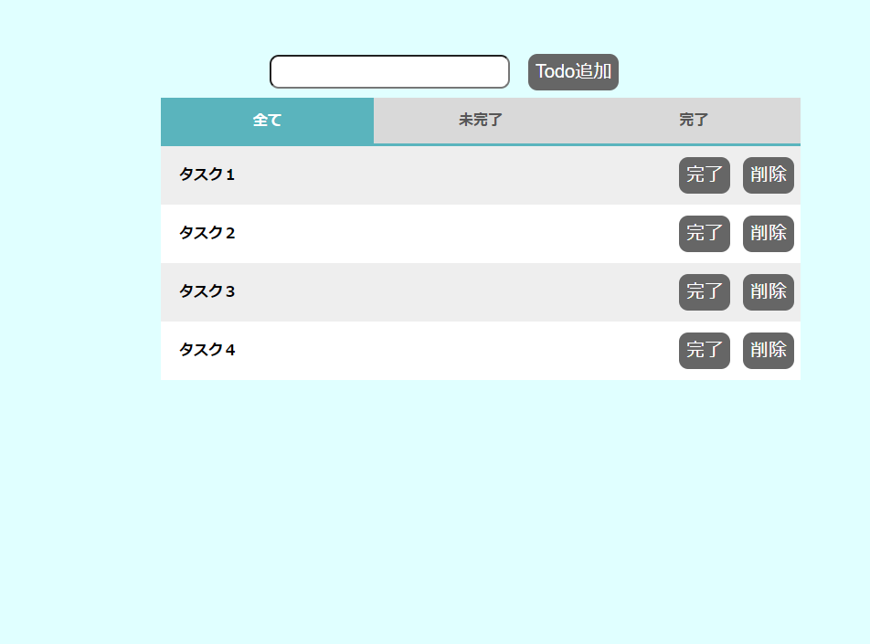
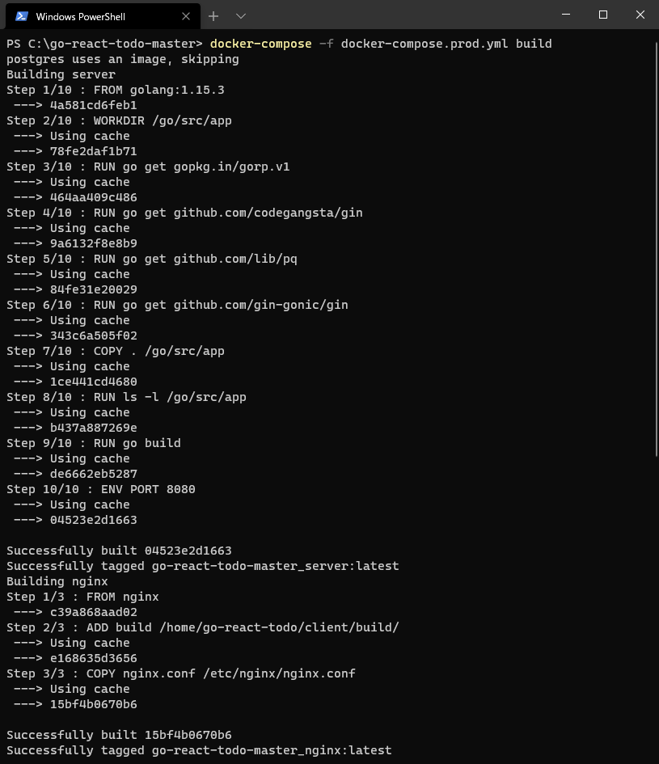
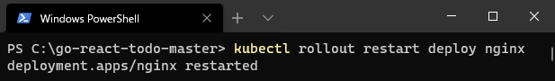
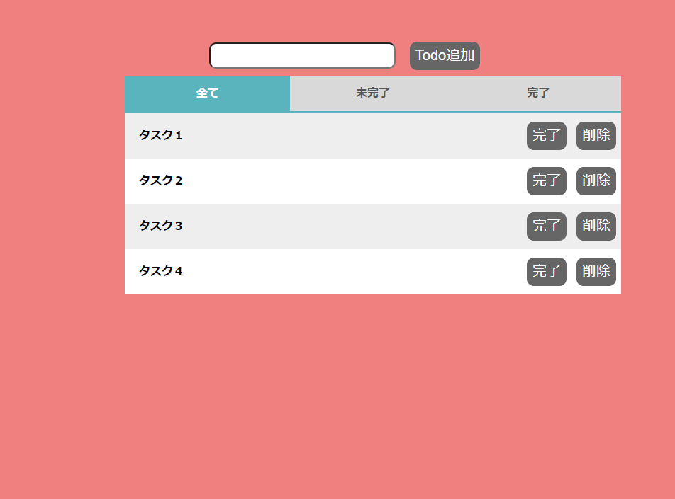

# Section3

## 修正したプログラムを反映しよう

実際にファイルを修正して、実際に修正された内容をどのようにデプロイするか確認してみましょう。  


1. 次のファイルを修正してください。  
    青背景から赤背景に変更します。

    対象ファイル：(go-react-todo-master)/client\src\stylesheets\main.less

    ```less
    - [2] background-color:lightcyan;
    + [2] background-color:lightcoral;
    - [6] background-color:lightcyan;
    + [6] background-color:lightcoral;
    ```

2. 修正したファイルをビルドします。

    ```shell
    docker-compose run --rm client npm run build
    ```

    

3. ビルドしたファイルをイメージにするため、イメージビルドを行います。

    ```shell
    docker-compose -f docker-compose.prod.yml build
    ```

    

4. Kubernetesにデプロイします。

    ```shell
    kubectl rollout restart deploy nginx
    ```

    

5. 赤い背景色になったらデプロイ完了です。
    
